  

  
  
  

  

---

## 🚀 About Me

- 🎓 B.Tech CSE @ **BVRIT Narsapur**
- 💻 Learning **MERN Stack & AI**
- 🤖 Building **AI-powered projects**
- 🌱 Currently learning **React, FastAPI & LangChain**
- 📫 Reach me: **gagankalakota85@gmail.com**

---

## 🛠️ Tech Stack

| Category | Technologies |
| :--- | :--- |
| **💻 Languages** |      |
| **🎨 Frontend** |     |
| **⚙️ Backend** |    |
| **🗄️ Database & SQL** |     |
| **🔧 Tools** |     |

---

## 🔥 Featured Projects

| Project | Description | Tech Stack | Link |
| :--- | :--- | :--- | :--- |
| **🛡️ ShinraiGo** | Smart Tourist Safety Monitoring System | React, Node.js, Express, MongoDB | [Repo](https://github.com/gagan2105/ShinraiGo) |
| **🔍 Wiki Search Engine** | Wikipedia search engine with responsive results | HTML, CSS, JavaScript, Bootstrap | [Repo](https://github.com/gagan2105/wiki-search-engine) |

---

## 📊 GitHub Stats

  
  

---

## 📈 Contribution Graph

  

---
